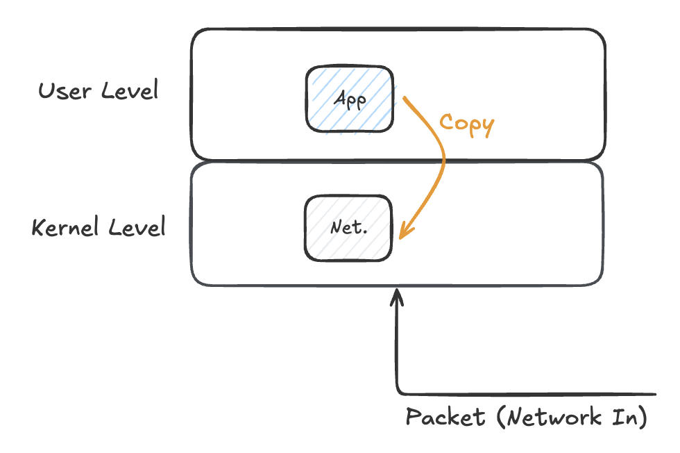
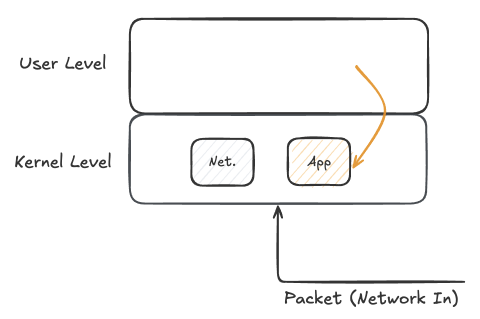
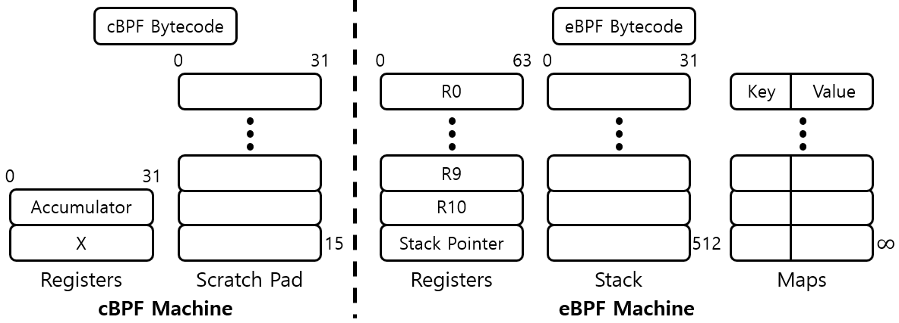
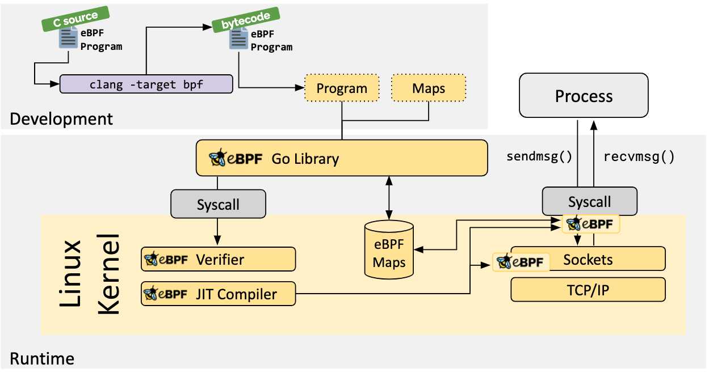

# eBPF
> 요약은 상단, 배경부터 조금 구체적인 내용은 하단에 기술

#### What is eBPF?
> 커스텀 코드를 Kernel level에서 실행하는 기술
기존의 앱은 User level에서 동작, eBPF는 Kernel level에서 간단한 코드를 동작시킬 수 있음
- **성능 항상** 

커스텀 코드를 Kernel level에서 실행 
- 원래도 커널에 코드 삽입 후 컴파일하면 커널 모듈에 동적으로 코드를 삽입하여 구동은 가능하다 → 코드 변경에 따른 영향도가 존재하기 때문에 불안정함
- eBPF는 커널 영역의 VM 환경에 코드를 삽입하여 **안정성 향상**

Kernel level에서 다양한 기능 및 범위를 제공
- 네트워크와 관련된 제한적 기능 외에 파일시스템, 보안 등 추가 기능 제공

#### Why eBPF?
서비스 운영을 위해 필요한 정보의 가시성 개선
- Kernel은 모든 정보(낮은 레벨부터)를 가지고 있고, 추가적으로 구성 및 취합할 수 있음
- 기존에는 Kernel level의 정보를 가져올 때 리눅스 커맨드를 호출 → 제한된 정보, 낮은 성능
- eBPF를 사용하면 안전하게 필요한 정보를 낮은 오버헤드로 가져올 수 있음

 

## BPF
> The BSD Packet Filter: A New Architecture for User-level Packet Capture 1993, Usenix

새로운 아키텍처의 사용자 레벨 패킷 필터
- 패킷 필터로 패킷을 분석하고 필터링하는데에 사용되는 in-kernel virtual machine
- VM 내 가상의 레지스터와 스택 등을 통해 코드를 실행

BSD에서 처음 도입했으며 리눅스에서도 이 개념을 차용하여 서브시스템 도입

 

### BPF 제안 배경 (기존 문제점)

> Kernel 레벨에 이미 구현된 network 관련 서브 시스템(그림 내 `Net.`)에서 수신한 패킷에 대해
>
> User 레벨에 사용자가 구현/실행한 애플리케이션(그림 내 `App`)이 패킷을 복사하여 필터링하는 방식

기존 패킷 필터링 방식의 비효율성
- **기존 네트워크 모니터링은 User 레벨에서 동작**
  - 네트워크 패킷은 커널 레벨을 타고 들어오기 때문에 유저 레벨에서 동작하는 애플리케이션이 커널 레벨의 패킷을 Copy 해서 필터링해야 함
  - 이로 인해 성능 저하가 발생

 

### BPF의 해결 방법

> Kernel 레벨에 필터링 코드를 배포하여 패킷 필터링을 진행

**Kernel 레벨에서 빠른 시점에 필터링 진행**
- 커널 레벨에 필터링하는 코드를 동작 (커널에 에이전트 배포)

**레지스터 기반으로 커널 내에서 동작하는 VM을 사용**
- 단순히 코드를 실행시키는 경우 불안정할 수 있기 때문에 VM을 사용하여 안정성을 확보

 

### BPF의 활용 (대표적인 애플리케이션)
`tcpdump` : 커널의 네트워크 패킷 정보를 필터링하여 저장

 

## eBPF (extended Berkeley Packet Filter)
BPF의 이름과 개념을 차용
- 확장된(extended) 이라는 표현을 사용하긴 했지만, 구조/구현적으로 새로운 기술로 볼 수도 있음
- 기존 BPF(네트워크 패킷 필터링에만 한정적)보다 다양한 기능 및 범위를 제공

eBPF는 커스텀 코드를 커널 레벨에서 실행하는 기술
- 원래도 커널에 코드 삽입 후 컴파일하면 커널 모듈에 동적으로 코드를 삽입하여 구동은 가능하다 → 코드 변경에 따른 영향도가 존재하기 때문에 불안정함
- eBPF는 커널 영역의 VM 환경에 코드를 삽입하여 안정성을 확보

서비스 운영을 위해 필요한 정보의 가시성 개선
- Kernel은 모든 정보(낮은 레벨부터)를 가지고 있고, 추가적으로 구성 및 취합할 수 있음
- 기존에는 Kernel level의 정보를 가져올 때 리눅스 커맨드를 호출 → 제한된 정보, 낮은 성능
- eBPF를 사용하면 안전하게 필요한 정보를 낮은 오버헤드로 가져올 수 있음

 

#### eBFP 구조: BFP와 eBPF의 가상머신 비교

> 구분을 위해 기존 BPF를 classic BPF 함
> 
> 최근에는 classic BPF로 만들어진 부분도 모두 eBPF로 다시 구현되었기 때문에 eBPF도 BPF라고 일컫을 때도 있음

레지스터, 명령어(Instruction set)의 증가, Maps, Helper functions 등의 추가
- 다양한 로직의 코드를 작성할 수 있게 됨 

유저/커널 레벨의 다양한 경로에 이벤트 기반으로 사용자 코드를 실행 (`uprobes`, `kprobes`, `tracepoints` 등의 event trigger)

 

### eBPF 프로그램 작성 및 동작

[eBPF 프로그램 작성](https://ebpf.io/what-is-ebpf/#how-are-ebpf-programs-written) (`첨부 이미지 좌상단`)
- C 코드에서 [LLVM](https://llvm.org/) 중간 표현으로 번역된 후 BPF 바이트 코드로 번역

[eBPF 프로그램 로드](https://ebpf.io/what-is-ebpf/#loader--verification-architecture) (`첨부 이미지 중단`)
- 바이트 코드를 검증한 후 JIT 컴파일러로 컴파일(= 실행할 수 있는 상태로 변경)

 

### eBPF의 활용 (대표적인 애플리케이션)
> https://ebpf.io/applications/

- `bcc`: BPF Compiler Collection (eBPF 관련 다양한 도구 모음)
- `Cilium` : 네트워크 보안 및 연결 관리

 

## 참고 자료
- https://ebpf.io/what-is-ebpf/
- https://www.datadoghq.com/knowledge-center/ebpf/
- https://www.ibm.com/docs/ko/qsip/7.4?topic=queries-berkeley-packet-filters
- https://medium.com/@megawan/an-introduction-to-bpf-and-ebpf-2839c2da7d5d
- https://hyeyoo.com/133