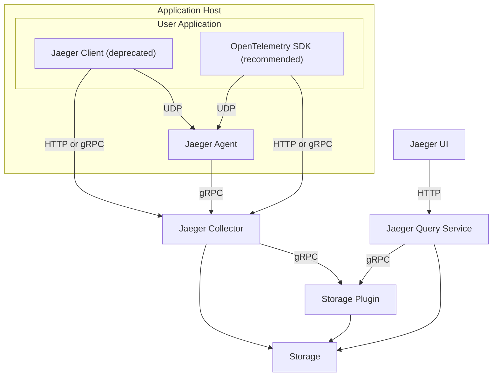

# Jaeger
## What is Jaeger?

> Jaeger, inspired by Dapper and OpenZipkin, is a **distributed tracing platform** created by Uber Technologies and donated to Cloud Native Computing Foundation. It can be used for monitoring microservices-based distributed systems:
> - Distributed context propagation
> - Distributed transaction monitoring
> - Root cause analysis
> - Service dependency analysis
> - Performance / latency optimization
> 
> ref. https://github.com/jaegertracing/jaeger

- Jaeger는 마이크로서비스라는 상호 연결된 소프트웨어 구성 요소를 모니터링하고 문제를 해결하는 데 사용할 수 있는 소프트웨어

### Distributed Tracing의 기본 아이디어
- 실행되는 컨포넌트마다 실행 시간과 추가 정보 수립
- 수집한 정보를 DB에 저장
- DB에 저장된 정보를 가지고 컨포넌트간의 연관관계를 재조합해서 Visualization 도구로 표시함

### Tracing Specification
#### OpenTracing
- CNCF project로 현재 deprecated 됨
- OpenTracing Observability 백엔드 서버에 telemetry data (metrics, log, traces)를 전송하기 위해 vendor-netural 표준화된 API를 제공한다
- 개발자는 OpenTracing API 표준화에 맞게 직접 라이브러리를 구현해야 한다

#### OpenCensus
- Google의 오픈 소스 커뮤니티 프로젝트
- OpenCensus는 개발자가 자기 어플리케이션을 계측해서 백엔드로 telemetry data를 전송할 수 있도록 언어별 라이브러리 세트를 제공한다

#### OpenTelemetry (OTel)
- OpenTracing + OpenCensus 프로젝트가 하나로 merge됨
- 2019년에 CNCF Incubation 프로젝트로 채택됨
- Trace, metric, log 와 같은 원격 측정 데이터를 기기, 생성, 수집 및 내보내기 위한 공급 업체-중립 오픈 소스 관찰 프레임워크이다

## MSA 환경과 OpenTracing이란
> 모놀리식(monolithic)과 MSA(Micro Service Architecture)에 대해서 간단하게 설명하겠습니다. 모놀리식의 경우 하나의 서버가 서비스의 전반적인 기능을 모두 제공합니다. 그로 인해 복잡도가 증가하고 역할을 나누기 어려운 등 많은 문제가 발생하지만, 클라이언트의 요청을 받으면 하나의 스레드에서 모든 요청을 실행하므로 로그를 확인하기 쉽다는 장점이 있습니다. 그에 반해 MSA의 경우에는 각 서비스의 복잡도가 낮아지고 역할 분담이 용이하지만 클라이언트의 요청을 받았을 때 여러 개의 마이크로 서비스 간에 통신이 발생해 로그를 확인하기 어려운 문제가 있습니다.
> 
> 이런 문제를 해결하기 위한 방법으로 [OpenTracing](https://medium.com/opentracing/towards-turnkey-distributed-tracing-5f4297d1736)이 알려져 있습니다.
>
> ref. https://engineering.linecorp.com/ko/blog/line-ads-msa-opentracing-zipkin/

- 마이크로서비스의 복잡한 동작으로 인해, 분산 시스템에서는 문제를 조사하기가 어려움
  - 요청은 독립적으로 동시에 발생할 수 있으며 꼭 순차적으로 발생하지 않음
- 문제가 생기면, 개발자들은 어떤 마이크로서비스가 그 문제를 야기했는지 확인해야 함
  - 기존의 문제 추적 방식은 요청의 일부에 대한 정보만 제공하므로 마이크로서비스 문제를 해결하는 데 시간이 많이 걸림
- 마이크로서비스 상호 작용 내의 요청 경로를 따라가거나 추적하기 위한 도구가 필요함

### Distributed Tracing vs Open Tracing
#### Distributed Tracing
> a method of tracking application requests as they flow from frontend devices to backend services and databases.

- 프런트 엔드 장치에서 백엔드 서비스 및 데이터베이스로 이동하는 응용 프로그램 요청을 추적하는 방법

#### Open Tracing
> an open-source project aimed at providing vendor-neutral APIs and instrumentation for distributed tracing.

- 분산 추적을 위한 오픈 소스 프로젝트

## Jaeger Terminology

#### Span
> A span represents a logical unit of work in Jaeger that has an operation name, the start time of the operation, and the duration. Spans may be nested and ordered to model causal relationships.

- 작업 이름, 작업 시작 시간 및 기간을 가진 논리적 작업 단위
- 관계를 모형화하기 위해 범위를 내포하고 순서를 지정

#### Trace
> A trace is a data/execution path through the system, and can be thought of as a directed acyclic graph of spans.

- 시스템을 통과하는 데이터/실행 경로를 나타내는 그래프

## Jaeger Components

#### Jaeger client libraries: OpenTelemetry Distro (SDK)
Jaeger 클라이언트에는 Go, JavaScript, Java, Python, Ruby 및 PHP와 같은 프로그래밍 언어로 작성된 OpenTracing API의 언어별 구현이 포함되어 있습니다.

개발자는 분산 추적을 위한 소스 코드를 작성하지 않고, 이러한 API를 사용하여 Jaeger 스팬을 만듭니다.

#### Agent
Jaeger 에이전트는 다른 프로세스에 필요한 기능을 수행하기 위해 백그라운드에서 지속적으로 실행되는 네트워크 데몬 또는 프로세스입니다. 네트워크를 통해 메시지를 교환할 수 있는 통신 방법의 일종인 사용자 데이터그램 프로토콜(UDP)을 통해 클라이언트가 전송하는 스팬을 수신합니다.

에이전트는 Amazon Elastic Kubernetes Service와 같은 컨테이너 환경에서 클라이언트에 연결합니다. 에이전트 그룹은 스팬을 배치 단위로 생성하여 수집기로 보냅니다. 이렇게 하면 트레이스 정보를 Jaeger 백엔드로 능동적으로 보내지 않고도 애플리케이션을 실행할 수 있습니다.

#### Collector
Jaeger 수집기는 Jaeger 수집기에서 트레이스를 검색하는 소프트웨어 구성 요소로, 트레이스를 확인하고 처리하며 데이터베이스에 저장합니다.

#### Storage
Jaeger 추적 시스템은 스팬을 수신하여 영구 스토리지 백엔드 또는 데이터베이스에 저장합니다. 영구 스토리지란 컴퓨터의 전원이 꺼진 경우에도 저장된 데이터가 그대로 유지되는 것을 의미합니다. 예를 들어 개발자는 스팬을 저장하고 수용하는 영구 스토리지로서 AWS OpenSearch Service를 사용합니다.

#### Ingester
Jaeger를 배포하는 방법 중 하나는 애플리케이션이 정보 스트림을 저장하고 검색하는 분산 시스템인 Kafka에 트레이스 데이터를 전송하는 것입니다. 인제스터는 Kafka에서 트레이스 데이터를 읽고 별도로 저장하는 모듈입니다.

#### Query
쿼리 서비스는 데이터베이스에서 트레이스 정보를 검색합니다. 개발자는 쿼리를 사용하여 특정 시간, 태그, 기간 및 작업이 포함된 트레이스를 찾습니다.

#### Console
Jaeger Console은 트레이스를 보고 분석하는 데 사용할 수 있는 사용자 인터페이스를 제공하는 소프트웨어 프로그램으로, 트레이스 데이터를 그래프와 차트로 표시합니다. 

- ref. https://www.jaegertracing.io/docs/1.23/architecture/

## References
- https://github.com/jaegertracing/jaeger
- https://blog.advenoh.pe.kr/cloud/Jaeger%EC%97%90-%EB%8C%80%ED%95%9C-%EC%86%8C%EA%B0%9C/
- https://www.jaegertracing.io/docs/1.23/architecture/
- https://engineering.linecorp.com/ko/blog/line-ads-msa-opentracing-zipkin/
- https://opencensus.io/
- https://blog.naver.com/alice_k106/221832024817
- https://m.blog.naver.com/freepsw/221945686208