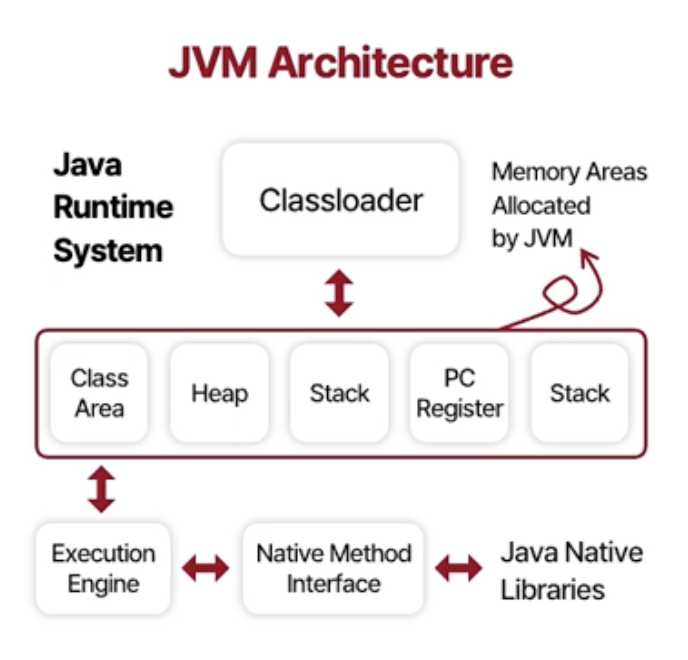
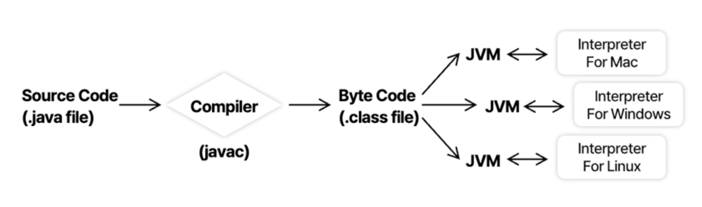
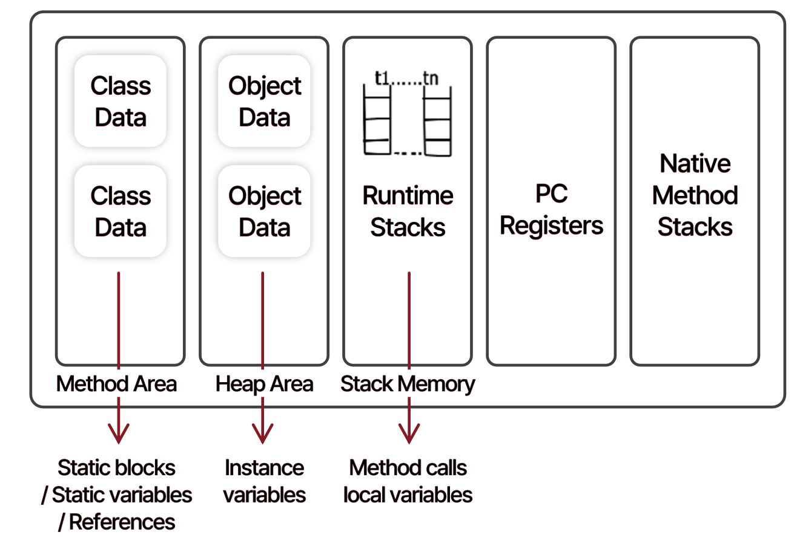
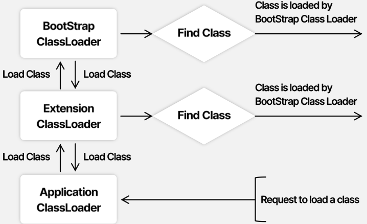

# JVM
- JVM(Java Virtual Machine)은 자바 애플리케이션이 수행되는 런타임 엔진을 의미
- JVM은 JRE(Java Runtime Environment)의 일부분에 속함

 

#### JVM 구조

#### 자바 컴파일 절차

## JVM 메모리 영역

#### Method area
- 클래스의 정보가 저장
- 클래스 로더에 의해 로드된 클래스 파일의 바이트 코드를 저장하는 공간

#### Heap area
- 객체와 배열이 생성되는 공간

#### Stack area
- 스레드 별로 사용하는 공간(스레드 별로 런타임 스택 생성)
- 메서드 콜, 지역 변수, 매개변수, 리턴 값, 연산 중 발생하는 임시 값 등이 저장

#### PC Register
- 스레드의 실행 위치(execution instruction 정보의 위치)를 저장

#### Native Method Stack
- 자바 외의 언어로 작성된 네이티브 코드(메서드)를 위한 스택

 

## 클래스 로딩 절차
> 클래스 로딩은 세 단계로 나뉨 (Loading, Linking, Initialization)

### 1. Loading
- 컴파일된 `.class` 파일을 읽음
- 바이트 코드를 `Method area`에 저장
  - `패키지명.클래스명` 저장
  - 클래스, 인터페이스, enum 여부 저장
  - 부모 클래스 저장
  - 접근제어자, 변수, 메서드 정보 저장
- `Heap area`에 `Class` 타입의 객체 생성

 

### 2. Linking
> Linking은 세 단계로 나뉨 (Verification, Preparation, Resolution)

#### 2.1. Verification
- `.class` 파일이 제대로 된 클래스 파일인지 검증
- `ByteCodeVerifier` 컴포넌트를 통해 진행

> `.class` 파일은 변조가 가능함. 그래서 컴파일 단계가 필요함
> 
> JVM 위에 유효하지 않은 코드가 올라가면 JVM crash 및 손상으로 인한 다운이 발생할 수 있음
> 
> 따라서 앞단의 Verification 단계에서 유효하지 않은 코드인지 검증이 필요함

#### 2.2. Preparation
- 클래스에 있는 `static` 변수들을 기본값으로 메모리에 할당

#### 2.3. Resolution
- 해당 타입의 기호 참조(Symbolic Reference)를 직접 참조(Direct Reference)로 변경
- 참조되는 엔티티들은 `Method area`에서 검색하여 수행

 

### 3. Initialization
- `static` 변수들의 값을 `static` 블록에서 선언한 값으로 초기화
- 클래스의 위에서부터 아래로 내려가면서 초기화
- 부모 클래스가 있을 경우, 부모 클래스를 먼저 처리한 후 자식 클래스를 처리

 

## Class Loader
- Bootstrap Class Loader
- Extension Class Loader
- System/Application Class Loader

### Bootstrap Class Loader
자바가 설치된 경로(`JAVA_JOME)/jre/lib`)에 있는 파일들을 로드
- 이 경로를 `Bootstrap Path`라고 함
- 파일들은 C/C++과 같은 네이티브 코드로 작성된 파일들

### Extension Class Loader
- Bootstrap Class Loader의 자식 클래스
- `JAVA_HOME/jre/lib/ext` 경로에 있는 파일들을 로드
- `sun.misc.Launcher$ExtClassLoader` 클래스를 통해 작업 수행

### System/Application Class Loader
- Extension Class Loader의 자식 클래스
- 애플리케이션의 classpath에 있는 파일들을 로드
- `sun.misc.Launcher$AppClassLoader` 클래스를 통해 작업 수행

 

## BCI
- BCI(Byte Code Instrumentation)는 클래스 파일을 로딩할 때 내용을 변조하는 기술
- APM, AOP 등에서 사용

 

## JVM 실행 엔진(JVM Execution Engine)
실행 엔진 3가지로 구성
- Interpreter
- JIT(Just-In-Time) Compiler
- Garbage Collector

 

### Interpreter
- 바이트 코드를 라인 단위(한 줄씩) 읽어서 번역하고 실행
- 반복되는 부분이 있어도 계속 번역 작업 수행

> 반복해서 호출하더라도 라인 단위로 계속해서 번역하고 실행하기 때문에 성능이 떨어짐
> 
> 이로 인해 JIT 컴파일러가 등장

 

### JIT(Just-In-Time) Compiler
- Interpreter를 효율적으로 활용하기 위해 사용
- 모든 바이트 코드를 컴파일한 후 네이티브 코드로 변환
- Interpreter가 반복적인 메서드 호출이 있을 때 JIT에서 해당 부분에 대한 네이티브 코드를 제공

> 자바 애플리케이션 첫 초기화 시 CPU가 급증함
>
> 흔히 warm-up이라고 불리는 과정이 JIT 컴파일러를 통해 네이티브 코드를 제공하는 과정
> 
> Interpreter가 반복적인 메서드 호출이 있을 때 JIT에서 해당 부분을 네이티브 코드로 변환하여 성능을 향상됨

 

### Garbage Collector
사용하지 않는 객체를 메모리에서 제거

