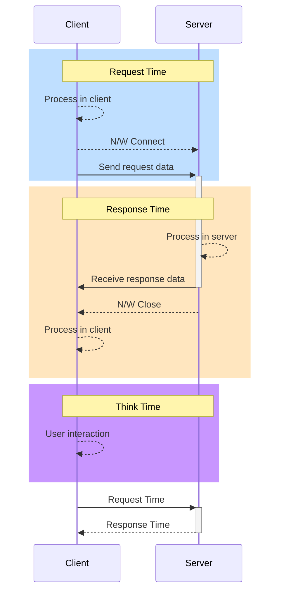

# 성능과 주요 지표

## 왜 성능이 중요할까?
[Why dose speed matter](https://web.dev/learn/performance/why-speed-matters)를 읽어보면 성능과 비즈니스의 성패가 영향이 있고, 어떠한 요소들로 인해 중요한지를 생각해볼 수 있음
- 사용자 리텐션에 영향 (Performance is about retaining users)
- 사용자의 서비스 전환율에 영향 (Performance is about improving conversions)
- 사용자 경험에 영향(Performance is about the user experience)

 

## 성능의 분야
크게 두 가지로 나눠볼 수 있음
- 웹(Web, Frontend) 성능
- 서버(Server, Backend) 성능

### 웹 기반의 성능 측정 지표
[Core Web Vitals](https://web.dev/articles/vitals): 웹에서 우수한 사용자 경험을 제공하는 데 필수적인 품질 기준에 대한 지침을 제공하기 위해 구글에서 지정한 지표
- 로드 성능(Largest Contentful Paint, `LCP`): 우수한 사용자 환경을 제공하려면 페이지가 처음 로드되기 2.5초 이내에 LCP가 발생해야 함
- 상호 작용(Interaction to Next Paint, `INP`): 우수한 사용자 환경을 제공하려면 페이지의 INP가 200밀리초 이하여야 함
- 시각적 안정성(Cumulative Layout Shift, `CLS`): 우수한 사용자 환경을 제공하려면 페이지의 CLS를 0.1 이하로 유지해야 함 (누적 레이아웃 변경 횟수)

#### 웹 페이지 측정 도구
- [PageSpeed Insights](https://pagespeed.web.dev/)
- [Chrome User Experience Report](https://developer.chrome.com/docs/crux)
    - `크롬 개발자 도구` - `performance insights`

 

## 성능의 주요 지표
| 지표 |            설명            |
|:---:|:------------------------:|
| 사용자(Users) | 서비스를 사용(부하를 생성)하는 사용자의 수 |
| 응답 시간(Response Time) |      각 요청에 대한 응답시간       |
| 초당 처리량(TPS) | 초당 처리 가능한 트랜잭션의 수 |
| 리소스 사용량(Resource Usage) | CPU, 메모리, 네트워크 등 부하 발생 시 리소스 사용량 |

### 사용자
성능 테스트 시 사용자는 두 가지로 나누어서 생각해볼 수 있음
- 활성 사용자(Active User): 서비스에 요청을 하고 응답을 받는 사용자
  - 서비스에 부하를 주는 사용자
  - 성능 테스트 시 Virtual User 와 동일하게 생각하면 됨
- 서비스 접속 사용자(Concurrent User): 서비스에 접속(세션)하고 있는 사용자 (동시 접속 사용자)
  - Active User 를 포함하는 의미
  - 서비스에 부하를 주거나 부하를 가할 가능성이 높은 사용자

### 응답시간
시스템 관점의 응답 시간
- 요청 시간(Request Time)과 응답 시간(Response Time)으로 분리 가능
- 응답 시간과 새로운 요청 시간과의 간격은 대기 시간(Think Time)으로 구분 가능
  - 성능 테스트 시에는 Think Time을 0으로 설정하여 테스트를 진행

`Request Time`: 클라이언트에서 서버로 요청을 보내기까지의 시간
> `Process in client` + `N/W Connect` + `Send request data`
- `Process in client`: 브라우저나 앱에서 사용자 요청을 처리하는데 걸리는 시간
- `N/W Connect`: 네트워크 연결 소요 시간
- `Send request data`: 요청 데이터를 서버로 전송하는 시간

`Response Time`: 서버에서 클라이언트로 응답을 받기까지의 시간
> `Process in server` + `Receive response data` + `N/W Close` + `Process in client`
- `Process in server`: 서버에서 요청을 처리하는데 걸리는 시간 (Network I/O, DB I/O, Cache 등)
  - 서버 처리 시간은 `CPU Time`과 `Wait Time`으로 나눌 수 있음
    - `CPU Time`: 서버에서 요청을 처리(연산)하는데 소요되는 시간
    - `Wait Time`: 서버에서 대기하는 시간 (DB 응답 대기, API 호출 대기)
- `Receive response data`: 응답 데이터를 클라이언트로 전송하는 시간
- `N/W Close`: 네트워크 연결 해제
- `Process in client`: 브라우저나 앱에서 응답을 처리하는데 걸리는 시간

### 처리량(TPS)
초당 처리 가능한 트랜잭션의 수
- 1초에 얼마나 많은 요청을 처리할 수 있는지를 나타내는 지표
- API 별로 측정할 수도 있지만, 기능(화면) 별로 TPS를 측정하는 것도 어느 정도 의미가 있음

 

## 성능 주요 지표의 상관 관계
### TPS와 Time 간의 관계
- TPS는 Scale out/up을 통해 증가시킬 수 있음
- Time은 Scale out/up을 통해 개선할 수 없음
- 둘 다 튜닝을 통 개선할 수 있음

### TPS와 사용자 수 간의 관계
- User가 증가함에 따라 TPS는 어느 정도로 증가하다가, TPS 최대치에 도달하면 더 이상 증가하지 않음

### 사용자 수와 응답시간 간의 관계
- User가 증가해도 응답 시간은 초기에 일정한 속도를 유지
- TPS가 최대치에 도달한 이후 응답 시간이 급격히 증가

### TPS와 응답시간 간의 관계
- TPS가 증가해도 응답속도는 증가하지 않음
- TPS가 최대치에 근접하면 응답속도가 급격히 증가

> TPS가 최대치에 도달하는 이유
> 
> - 병목지점이 존재하기 때문
> - 따라서 병목지점을 파악하고 개선하는 것이 중요
