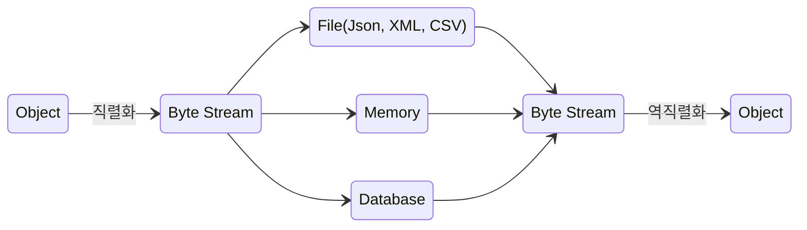

# 자바 직렬화와 역직렬화

#### 함께 읽어보면 좋은 내용: [Effective Java (Item 85~90)](https://github.com/Effective-Java-Camp/effective-java-3rd/issues?q=sort%3Aupdated-desc+is%3Aissue+is%3Aopen+label%3A12%EC%9E%A5)
- Item 85. 자바 직렬화의 대안을 찾으라
- Item 86. Serializable을 구현할지는 신중히 결정하라
- Item 87. 커스텀 직렬화 형태를 고려해보라
- Item 88. readObject 메서드는 방어적으로 작성하라
- Item 89. 인스턴스 수를 통제해야 한다면 readResolve보다는 열거 타입을 사용하라
- Item 90. 직렬화된 인스턴스 대신 직렬화 프록시 사용을 겁토하라

<br>

## 직렬화(Serialization)와 역직렬화(Deserialization)



`직렬화`와 `역직렬화`는 자바 뿐만 아니라 컴퓨터 과학에서 통용되는 개념
- `직렬화(Serialization)`: 자바가 객체를 바이트 스트림으로 인코딩하는 것
- `역직렬화(Deserialization)`: 반대로 바이트 스트림으로부터 다시 객체를 재구성하는 것

직렬화된 객체는 다른 VM에 전송하거나 디스크에 저장한 후 나중에 역직렬화할 수 있음

<br>

### 직렬화가 필요한 이유
서로 다른 시스템 간에 데이터를 교환하거나 공유할 때, 일관된 데이터 형식을 유지하기 위함

각 시스템은 자체적으로 데이터를 저장하고 표현하는 방식을 가지고 있는데 이런 데이터 형식은 서로 호환되지 않을 수 있으며 데이터를 교환하거나 공유하기 어려움

따라서 직렬화를 통해 일관된 형식으로 표현함으로써 데이터를 효율적으로 교환하고 공유할 수 있음

<br>

## 자바 직렬화 방법 (`java.io.Serializable`)

### 직렬화 구현
직렬화가 필요한 클래스에 `java.io.Serializable` 인터페이스를 구현

```java
import java.io.Serializable;

public class Account implements Serializable {
    Long id;
    String name;
}
```

`java.io.Serializable`는 메소드가 없는 인터페이스로 클래스가 직렬화 가능한 클래스인지 판단하는 기준으로 활용
- Serializable 인터페이스를 구현 여부에 따라 직렬화를 수행할지 말지 결정

<br>

부모 클래스가 Serializable 인터페이스를 구현하면 자식 클래스도 직렬화 가능

```java
public class Car implements Serializable {
    String name;
    int speed;
}

// Bus 클래스는 Car 클래스를 상속받기 때문에 직렬화 가능
public class Bus extends Car {
    int seat;
}
```

클래스 내부에 직렬화할 수 없는 클래스의 객체를 인스턴스 변수가 참조하고 있는 경우 직렬화 시 예외가 발생함


```java
// 직렬화를 구현하지 않은 클래스
public class Engine {
    String provider;
}

// 내부 인스턴스 변수가 직렬화를 구현하지 않았기 때문에 직렬화 시 예외 발생
public class Car implements Serializable {
    String name;
    int speed;
    Engine engine;
}
```

<br>

### 직렬화 포함 여부 제어 (`transient`)

제어자 `transient`를 붙여서 직렬화 대상에서 제외되도록 할 수 있음
- 목적(e.g. 보안, 직렬화 필요 여부)에 의해 직렬화가 되면 안 되는 필드에 `transient`를 사용하여 직렬화 대상에서 제외


```java
public class Car implements Serializable {
    String name;
    int speed;
    transient Engine engine; // 직렬화 제외
}
```

<br>

### 직렬화 (`ObjectOutputStream`, `ObjectInputStream`)

직렬화(객체를 스트림에 출력)에는 `ObjectOutputStream`을 사용

역직렬화에는 `ObjectInputStream`을 사용


```java
public class SerializableTest {

    // Byte Array 로 직렬화
    ByteArrayOutputStream serializeToByteArray(Car car) {
        try (ByteArrayOutputStream bos = new ByteArrayOutputStream();
             ObjectOutputStream out = new ObjectOutputStream(bos)) {
          out.writeObject(car);
          return bos;
        } catch (IOException e) {
          e.printStackTrace();
        }
        return null;
    }
  
    // Byte Array 를 통해 역직렬화
    Car deserializeFromByteArray(ByteArrayOutputStream bos) {
        try (ObjectInputStream in = new ObjectInputStream(new ByteArrayInputStream(bos.toByteArray()))) {
          return (Car) in.readObject();
        } catch (IOException | ClassNotFoundException e) {
          e.printStackTrace();
        }
        return null;
    }
    
    // 파일로 직렬화
    void serializeToFile(Car car, String fileName) {
        try (FileOutputStream fos = new FileOutputStream(fileName);
             ObjectOutputStream out = new ObjectOutputStream(fos)) {
            out.writeObject(car);
        } catch (IOException e) {
            e.printStackTrace();
        }
    }
    
    // 파일에서 역직렬화
    Car deserializeFromFile(String fileName) {
        try (FileInputStream fis = new FileInputStream(fileName);
             ObjectInputStream in = new ObjectInputStream(fis)) {
            return (Car) in.readObject();
        } catch (IOException | ClassNotFoundException e) {
            e.printStackTrace();
        }
        return null;
    }
}
```

#### serialVersionID
직렬화된 객체를 역직렬화할 때는 직렬화 했을 때와 같은 클래스를 사용해야 함

또한 클래스의 이름이 같더라도 클래스의 내용이 변경되면 역직렬화는 실패함
- 객체가 직렬화할 때 클래스에 정의된 멤버들의 정보를 이용해 `serialVersionID` 라는 클래스의 버전을 자동 생성하여 직렬화 내용에 포함
- 역직렬화할 때 클래스의 버전을 비교해 직렬화할때의 클래스의 버전과 일치하는지 확인할 수 있음

객체를 직렬화한 후 외부 전송(네트워크 통신)하는 경우 송신자와 수신자가 모두 같은 버전의 클래스를 가지고 있어야 함
- 클래스가 조금만 변경되어도 클래스를 다시 재배포 하는 것은 프로그램 유지보수에 용이하지 않음
- 이럴 때는 클래스의 버전을 수동으로 관리할 수 있음

```java
public class Car implements Serializable {
    static final long serialVersionUID=  101L; // 수동 관리

    String name;
    int speed;
    transient Engine engine; // 직렬화 제외
}
```

`serialVersionUID` 를 명시적으로 지정하면 직렬화된 객체를 역직렬화할 때 클래스가 다르더라도 `serialVersionUID` 가 같으면 역직렬화를 진행

<br><br>

> 자바가 직렬화 시 JSON이 아닌 자바 직렬화를 사용하는 이유

JSON과 같은 일반적인 직렬화를 사용할 수는 있음

다만 자바 직렬화의 경우 자바 시스템에 최적화되어 있음

클래스의 객체가 복잡해지는 경우 JSON으로 저장하기 어렵지만, 자바 직렬화의 경우 타입만으로 객체를 저장할 수 있음

<br>

> 자바 직렬화 사용 예

자바 직렬화는 객체 데이터를 영속화하고 전송할 수 있는 특성으로 여러 곳에서 사용
- `영속화`: 객체를 지속적으로 저장하고, 나중에 불러와 사용할 수 있는 기능

세션을 관리하거나 여러 서버 간에 공유하기 위해 DB에 저장하거나 Redis와 같은 캐시 서버에 저장하는 경우 자바 직렬화를 이용할 수 있음

혹은 캐시를 저장 및 조회할 때 자바 직렬화를 사용할 수 있고, 메시징 시스템에서 메시지를 전송할 때도 사용할 수 있음

다만 저장소에 바이트 스트림으로 저장되기 때문에 가독성이 떨어지기 때문에 외부 관리 인프라에 적합하게 사용하면 됨
- 필수적으로 자바 직렬화를 사용해야 할 필요는 없음
- 오히려 역직렬화의 취약점이 존재(ref. Effective Java - Item 85. 자바 직렬화의 대안을 찾으라)
