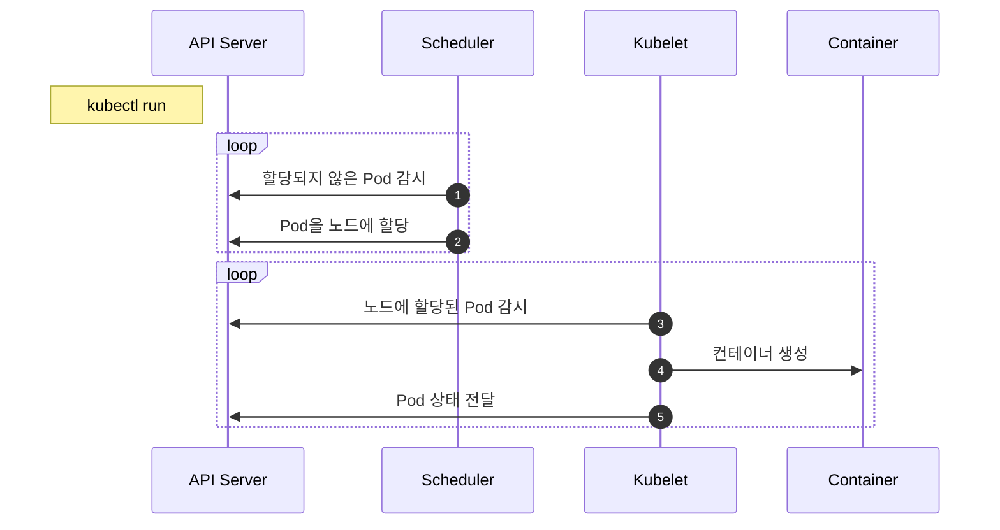
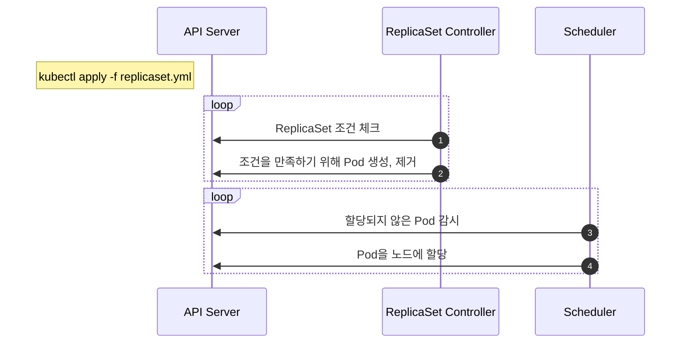
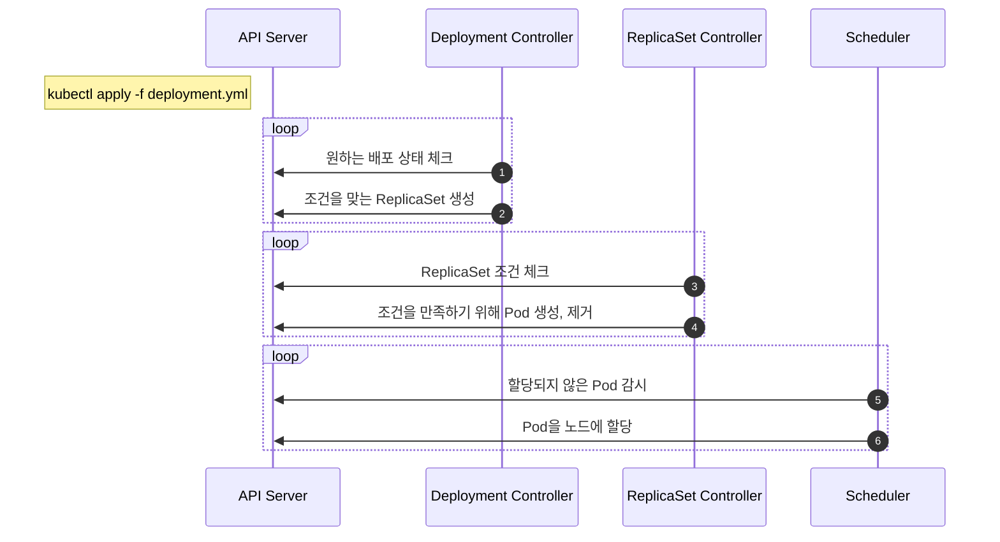
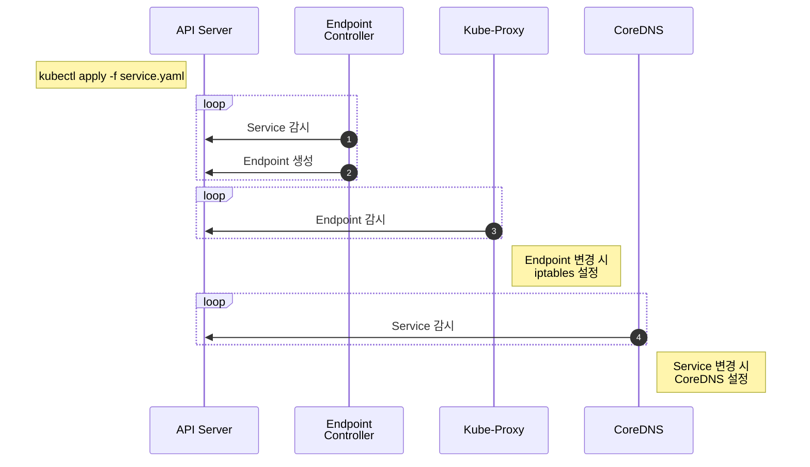
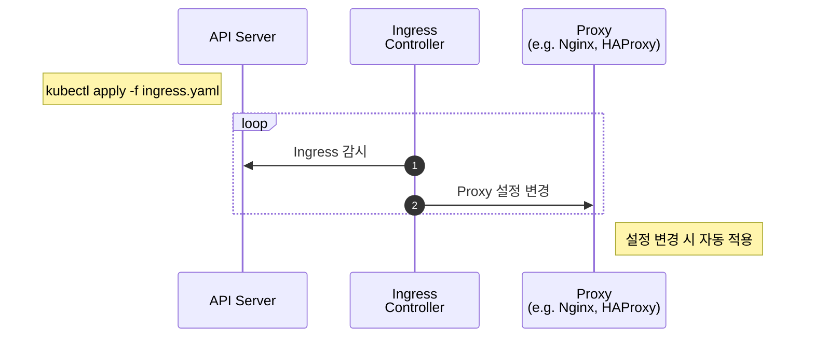

# 초보를 위한 쿠버네티스 안내서 by subicura
> https://subicura.com/k8s/guide/

## 시작하기
wordpress, mariadb 이미지를 이용해 k8s에 배포

### minikube 세팅

<details>
<summary>Detail</summary>
<div markdown="1">

#### Install
```shell
breow install minikube
```

#### Usage
```shell
# 버전확인
minikube version

# 가상머신 시작 (x86 추천)
minikube start --driver=hyperkit
# 가상머신 시작 (M1 추천 - 도커 데스크탑 설치 필요)
minikube start --driver=docker
# driver 에러가 발생한다면 virtual box를 사용
minikube start --driver=virtualbox
# 특정 kubernetes 버전 실행
minikube start --kubernetes-version=v1.23.1

# 상태확인
minikube status

# 정지
minikube stop

# 삭제
minikube delete

# ssh 접속
minikube ssh

# ip 확인
minikube ip
```

#### 이미지 실행
```shell
docker compose up -d
```

</div>
</details>

### k8s 배포
#### 적용
```shell
kubectl apply -f wordpress-kubernetes.yaml
```

#### 확인
```shell
kubectl get all
```

#### 삭제
```shell
kubectl delete -f wordpress-kubernetes.yml
```

## 기본 명령어
### kubectl 명령어
|명령어|설명|
|---|---|
|apply|원하는 상태를 적용합니다. 보통 -f 옵션으로 파일과 함께 사용합니다.|
|get|리소스 목록을 보여줍니다.|
|describe|리소스의 상태를 자세하게 보여줍니다.|
|delete|리소스를 제거합니다.|
|logs|컨테이너의 로그를 봅니다.|
|exec|컨테이너에 명령어를 전달합니다. 컨테이너에 접근할 때 주로 사용합니다.|
|config|kubectl 설정을 관리합니다.|


## Pod
Pod은 쿠버네티스에서 관리하는 가장 작은 배포 단위

쿠버네티스와 도커의 차이점은 도커는 컨테이너를 만들지만, 쿠버네티스는 컨테이너 대신 Pod을 만듭니다. Pod은 한 개 또는 여러 개의 컨테이너를 포함

### Pod 생성 분석


1. Scheduler는 API서버를 감시하면서 할당되지 않은 unassigned Pod이 있는지 체크
2. Scheduler는 할당되지 않은 Pod을 감지하고 적절한 노드(node)에 할당 (minikube는 단일 노드)
3. 노드에 설치된 kubelet은 자신의 노드에 할당된 Pod이 있는지 체크
4. kubelet은 Scheduler에 의해 자신에게 할당된 Pod의 정보를 확인하고 컨테이너 생성
5. kubelet은 자신에게 할당된 Pod의 상태를 API 서버에 전달

### 컨테이너 상태 모니터링
#### livenessProbe
컨테이너가 정상적으로 동작하는지 체크하고 정상적으로 동작하지 않는다면 컨테이너를 재시작하여 문제를 해결

`정상`이라는 것은 여러 가지 방식으로 체크할 수 있는데 여기서는 http get 요청을 보내 확인하는 방법을 사용

```yaml
apiVersion: v1
kind: Pod
metadata:
  name: echo-lp
  labels:
    app: echo
spec:
  containers:
    - name: app
      image: ghcr.io/subicura/echo:v1
      livenessProbe:
        httpGet:
          path: /not/exist
          port: 8080
        initialDelaySeconds: 5
        timeoutSeconds: 2 # Default 1
        periodSeconds: 5 # Defaults 10
        failureThreshold: 1 # Defaults 3
```

> **상태체크**
> 
> httpGet 외에 tcpSocket, exec 방법으로 체크할 수 있음

#### readinessProbe
컨테이너가 준비되었는지 체크하고 정상적으로 준비되지 않았다면 **Pod으로 들어오는 요청을 제외**

**livenessProbe와 차이점은 문제가 있어도 Pod을 재시작하지 않고 요청만 제외**

```yaml
apiVersion: v1
kind: Pod
metadata:
  name: echo-rp
  labels:
    app: echo
spec:
  containers:
    - name: app
      image: ghcr.io/subicura/echo:v1
      readinessProbe:
        httpGet:
          path: /not/exist
          port: 8080
        initialDelaySeconds: 5
        timeoutSeconds: 2 # Default 1
        periodSeconds: 5 # Defaults 10
        failureThreshold: 1 # Defaults 3
```

#### livenessProbe + readinessProbe
보통 livenessProbe와 readinessProbe를 같이 적용

```yaml
apiVersion: v1
kind: Pod
metadata:
  name: echo-health
  labels:
    app: echo
spec:
  containers:
    - name: app
      image: ghcr.io/subicura/echo:v1
      livenessProbe:
        httpGet:
          path: /
          port: 3000
      readinessProbe:
        httpGet:
          path: /
          port: 3000
```

### 다중 컨테이너
대부분 `1 Pod` = `1 컨테이너`지만 여러 개의 컨테이너를 가진 경우도 꽤 흔함

하나의 Pod에 속한 컨테이너는 **서로 네트워크를 localhost로 공유하고 동일한 디렉토리를 공유**할 수 있음

```yaml
apiVersion: v1
kind: Pod
metadata:
  name: counter
  labels:
    app: counter
spec:
  containers:
    - name: app
      image: ghcr.io/subicura/counter:latest
      env:
        - name: REDIS_HOST
          value: "localhost"
    - name: db
      image: redis
```

#### 컨테이너별 로그 조회
```shell
# Pod 로그 확인
kubectl logs counter # 오류 발생 (컨테이너 지정 필요)
kubectl logs counter app
kubectl logs counter db
```

## ReplicaSet
Pod을 단독으로 만들면 Pod에 어떤 문제(서버가 죽어서 Pod이 사라졌다던가)가 생겼을 때 자동으로 복구되지 않음

이러한 Pod을 정해진 수만큼 복제하고 관리하는 것이 ReplicaSet

### ReplicaSet 만들기
```yaml
apiVersion: apps/v1
kind: ReplicaSet
metadata:
  name: echo-rs
spec:
  replicas: 2
  selector:
    matchLabels:
      app: echo
      tier: app
  template:
    metadata:
      labels:
        app: echo
        tier: app
    spec:
      containers:
        - name: echo
          image: ghcr.io/subicura/echo:v1
```

ReplicaSet은 `label`을 체크해서 `원하는 수`의 Pod이 없으면 `새로운 Pod`을 생성

= `matchLabels`의 조건에 알맞는 label을 가진 Pod이 없으면 `template`에 정의된 Pod을 생성

|      정의       |     설명      |
|:-------------:|:-----------:|
| `spec.replicas` | 원하는 Pod의 개수 |
| `spec.selector` | label 체크 조건 |
| `spec.template` | 생성할 Pod의 명세 |

#### ReplicaSet 동작 과정


1. ReplicaSet Controller는 ReplicaSet조건을 감시하면서 현재 상태와 원하는 상태가 다른 것을 체크
2. ReplicaSet Controller가 원하는 상태가 되도록 Pod을 생성하거나 제거
3. Scheduler는 API서버를 감시하면서 할당되지 않은 unassigned Pod이 있는지 체크
4. Scheduler는 할당되지 않은 새로운 Pod을 감지하고 적절한 노드node에 배치
5. 이후 노드는 기존대로 동작

### Scale In/Out
`spec.replicas`의 값을 변경하여 적용

### 마무리
ReplicaSet은 원하는 개수의 Pod을 유지하는 역할을 담당

label을 이용하여 Pod을 체크하기 때문에 label이 겹치지 않게 신경써서 정의

실전에서 ReplicaSet을 단독으로 쓰는 경우는 거의 없음, **Deployment가 ReplicaSet을 이용하고 주로 Deployment를 사용**

## Deployment
### Deployment 만들기
```yaml
apiVersion: apps/v1
kind: Deployment
metadata:
  name: echo-deploy
spec:
  replicas: 4
  selector:
    matchLabels:
      app: echo
      tier: app
  template:
    metadata:
      labels:
        app: echo
        tier: app
    spec:
      containers:
        - name: echo
          image: ghcr.io/subicura/echo:v1
```

kind, type을 제외하곤 ReplicaSet과 거의 유사

결과 또한 ReplicaSet과 비슷해 보이지만 Deployment의 진가는 **Pod을 새로운 이미지로 업데이트할 때 발휘**

이미지를 아래와 같이 변경하는 경우 (v1 -> v2)

```yaml
apiVersion: apps/v1
kind: Deployment
metadata:
  name: echo-deploy
spec:
  replicas: 4
  selector:
    matchLabels:
      app: echo
      tier: app
  template:
    metadata:
      labels:
        app: echo
        tier: app
    spec:
      containers:
        - name: echo
          image: ghcr.io/subicura/echo:v2
```

Pod이 모두 새로운 버전으로 업데이트됨

> Pod 업데이트
>
> 엄밀히 말하면 "Pod을 새로운 버전으로 업데이트한다"는 건 잘못된 표현이고, "새로운 버전의 Pod을 생성하고 기존 Pod을 제거한다"가 정확한 표현


Deployment는 새로운 이미지로 업데이트하기 위해 ReplicaSet을 이용

**버전을 업데이트하면 새로운 ReplicaSet을 생성하고 해당 ReplicaSet이 새로운 버전의 Pod을 생성**

<details>
<summary>적용 과정</summary>
<div markdown="1">


</div>
</details>

#### Deployment 동작 과정


1. Deployment Controller는 Deployment조건을 감시하면서 현재 상태와 원하는 상태가 다른 것을 체크
2. Deployment Controller가 원하는 상태가 되도록 ReplicaSet 설정
3. ReplicaSet Controller는 ReplicaSet조건을 감시하면서 현재 상태와 원하는 상태가 다른 것을 체크
4. ReplicaSet Controller가 원하는 상태가 되도록 Pod을 생성하거나 제거
5. Scheduler는 API서버를 감시하면서 할당되지 않은unassigned Pod이 있는지 체크
6. Scheduler는 할당되지 않은 새로운 Pod을 감지하고 적절한 노드node에 배치
7. 이후 노드는 기존대로 동작

Deployment는 Deployment Controller가 관리하고 ReplicaSet과 Pod은 기존 Controller와 Scheduler가 관리

### 버전 관리
Deployment는 변경된 상태를 기록
```shell
# 히스토리 확인
kubectl rollout history deploy/echo-deploy

# revision 1 히스토리 상세 확인
kubectl rollout history deploy/echo-deploy --revision=1

# 바로 전으로 롤백
kubectl rollout undo deploy/echo-deploy

# 특정 버전으로 롤백
kubectl rollout undo deploy/echo-deploy --to-revision=2
```

### 배포 전략 설정
Deployment 다양한 방식의 배포 전략 존재

여기선 롤링업데이트(RollingUpdate) 방식을 사용할 때 동시에 업데이트하는 Pod의 개수를 변경 적용

```yaml
apiVersion: apps/v1
kind: Deployment
metadata:
  name: echo-deploy-st
spec:
  replicas: 4
  selector:
    matchLabels:
      app: echo
      tier: app
  minReadySeconds: 5
  strategy:
    type: RollingUpdate
    rollingUpdate:
      maxSurge: 3
      maxUnavailable: 3
  template:
    metadata:
      labels:
        app: echo
        tier: app
    spec:
      containers:
        - name: echo
          image: ghcr.io/subicura/echo:v1
          livenessProbe:
            httpGet:
              path: /
              port: 3000
```

#### `spec.minReadySeconds`
새로운 Pod를 생성한 뒤의 최소 대기 시간을 설정하는 옵션

너무 짧으면 ready에서 곧바로 avaliable이 되고 순단 현상이 일어날 수 있음

#### `strategy.type`
`Recreate` or `RollingUpdate`를 설정 가능

기본값은 `RollingUpdate`, Recreate의 경우 Pod가 삭제된 후 재생성

#### `strategy.rollingUpdate.maxSurge`
업데이트(rolling update) 과정에서 spec.replicas 수 기준 최대 새로 추가되는 파드 수

#### `strategy.rollingUpdate.maxUnavailable`
업데이트 과정(rolling update)에 spec.replicas 수 기준 최대 이용 불가능 파드 수

> **배포 전략**
>
> maxSurge와 maxUnavailable의 기본값은 25%입니다.
> 
> 대부분의 상황에서 적당하지만 상황에 따라 적절하게 조정이 필요합니다.

#### maxSurge와 maxUnavailable의 적용 예
1. [새 파드 생성] => [기존 파드 삭제] 반복 전략
- 방법
  - spec.replicas가 10인데 maxSurge 옵션이 1이면 최대 Pod 수가 11개까지 가능
  - 롤링 업데이트 시에 새로운 레플리카에 Pod를 1개 만든 이후에, 기존 레플리카의 Pod를 1개씩 지워가는 방식으로 이동
  - 이 경우 maxUnavailable 옵션은 0으로 고정해서 사용
- 장/단점
  - 장점: 노드 자원의 수가 기본 spec 설정값 미만으로 떨어질 일이 없음
  - 단점: 노드 자원의 수가 간혹 기본 spec 설정값을 초과하여 클러스터에 부담을 줄 수 있음

2. [기존 파드 삭제] => [새 파드 생성] 반복 전략
- 방법
  - spec.replicas가 10인데 maxUnavailable 옵션이 1이면 최대 Pod 수가 9개까지 가능
  - 롤링 업데이트 시에 기존 레플리카의 Pod를 1개를 삭제한 이후에, 새로운 레플리카에 Pod를 1개씩 만드는 방식으로 이동
  - maxSurge 옵션은 0으로 고정해서 사용
- 장/단점
  - 장점: 노드 자원의 수가 기본 spec 설정값을 초과할 일이 없음
  - 단점: 노드 자원의 수가 간혹 기본 spec 설정값 미만으로 떨어져 트래픽 대응 레벨이 떨어질 수 있음

### 마무리
Deployment는 가장 흔하게 사용하는 배포 방식

이외에 목적에 따라 StatefulSet, DaemonSet, CronJob, Job를 사용할 수 있고, 사용법은 크게 다르지 않음

Pod, ReplicaSet, Deployment가 컨테이너와 관련된 개념이었다면, 이러한 Pod를 Service, Ingress를 활용하여 외부로 노출할 수 있음

## Service
Pod은 자체 IP를 가지고 다른 Pod과 통신할 수 있지만, 쉽게 사라지고 생성되는 특징 때문에 직접 통신하는 방법은 권장하지 않음

쿠버네티스는 Pod과 직접 통신하는 방법 대신, 별도의 고정된 IP를 가진 서비스를 만들고 그 서비스를 통해 Pod에 접근하는 방식을 사용


노출 범위에 따라 `CluterIP`, `NodePort`, `LoadBalancer` 타입으로 나뉨

### Service (ClusterIP)
ClusterIP는 클러스터 내부에 새로운 IP를 할당하고 여러 개의 Pod을 바라보는 로드밸런서 기능을 제공

서비스 이름을 내부 도메인 서버에 등록하여 Pod 간에 서비스 이름으로 통신할 수 있음

```yaml
apiVersion: apps/v1
kind: Deployment
metadata:
  name: redis
spec:
  selector:
    matchLabels:
      app: counter
      tier: db
  template:
    metadata:
      labels:
        app: counter
        tier: db
    spec:
      containers:
        - name: redis
          image: redis
          ports:
            - containerPort: 6379
              protocol: TCP

---
apiVersion: v1
kind: Service
metadata:
  name: redis
spec:
  ports:
    - port: 6379
      targetPort: 6379
      protocol: TCP
  selector:
    app: counter
    tier: db
```


`spec.type` 생략 시 `ClusterIP`로 설정

|      정의       |                  설명                   |
|:-------------:|:-------------------------------------:|
| `spec.ports.port` |             서비스가 생성할 Port             |
| `spec.ports.targetPort` | 서비스가 접근할 Pod의 Port<br/>(기본: port랑 동일) |
| `spec.selector` |              서비스가 접근할 Pod의 label 조건              |

### Service 생성 흐름


1. Endpoint Controller는 Service와 Pod을 감시하면서 조건에 맞는 Pod의 IP를 수집
2. Endpoint Controller가 수집한 IP를 가지고 Endpoint 생성
3. Kube-Proxy는 Endpoint 변화를 감시하고 노드의 iptables을 설정
4. CoreDNS는 Service를 감시하고 서비스 이름과 IP를 CoreDNS에 추가

iptables는 커널(kernel) 레벨의 네트워크 도구이고 CoreDNS는 빠르고 편리하게 사용할 수 있는 클러스터 내부용 도메인 네임 서버

각각의 역할은 iptables 설정으로 여러 IP에 트래픽을 전달하고 CoreDNS를 이용하여 IP 대신 도메인 이름을 사용

> **iptables**
>
> iptables는 규칙이 많아지면 성능이 느려지는 이슈가 있어, ipvs를 사용하는 옵션도 있습니다.

> **CoreDNS**
>
> CoreDNS는 클러스터에서 호환성을 위해 kube-dns라는 이름으로 생성됩니다.

### Service (NodePort)
ClusterIP는 클러스터 내부에서만 접근할 수 있습니다. 클러스터 외부(노드)에서 접근할 수 있도록 NodePort 서비스를 만들 수도 있음

```yaml
apiVersion: v1
kind: Service
metadata:
  name: counter-np
spec:
  type: NodePort
  ports:
    - port: 3000
      protocol: TCP
      nodePort: 31000
  selector:
    app: counter
    tier: app
```

|          정의           |                      설명                      |
|:---------------------:|:--------------------------------------------:|
| `spec.ports.nodePort` | 노드에 오픈할 Port<br/>(미지정시 30000-32768 중에 자동 할당) |


NodePort는 클러스터의 모든 노드에 포트를 오픈

여러 개의 노드가 있다면 아무 노드로 접근해도 지정한 Pod으로 접근


### Service (LoadBalancer)
NodePort의 단점은 노드가 사라졌을 때 자동으로 다른 노드를 통해 접근이 불가능

예를 들어, 3개의 노드가 있다면 3개 중에 아무 노드로 접근해도 NodePort로 연결할 수 있지만 어떤 노드가 살아 있는지는 알 수 없음


자동으로 살아 있는 노드에 접근하기 위해 모든 노드를 바라보는 `Load Balancer`가 필요

브라우저는 NodePort에 직접 요청을 보내는 것이 아니라 Load Balancer에 요청하고 Load Balancer가 알아서 살아 있는 노드에 접근하면 NodePort의 단점을 없앨 수 있음

```yaml
apiVersion: v1
kind: Service
metadata:
  name: counter-lb
spec:
  type: LoadBalancer
  ports:
    - port: 30000
      targetPort: 3000
      protocol: TCP
  selector:
    app: counter
    tier: app
```

### 마무리 
실전에선 NodePort와 LoadBalancer를 제한적으로 사용

보통 웹 애플리케이션을 배포하면 80 또는 443 포트를 사용하고 하나의 포트에서 여러 개의 서비스를 도메인이나 경로에 따라 다르게 연결하기 때문

이 부분을 Ingress에서 처리

## Ingress
```yaml
# v1.ingress.yaml
apiVersion: networking.kubernetes.io/v1
kind: Ingress
metadata:
  name: echo-v1
spec:
  rules:
    - host: v1.echo.192.168.64.5.sslip.io
      http:
        paths:
          - path: /
            pathType: Prefix
            backend:
              service:
                name: echo-v1
                port:
                  number: 3000
```
```yaml
# v2.ingress.yaml
apiVersion: networking.kubernetes.io/v1
kind: Ingress
metadata:
  name: echo-v2
spec:
  rules:
    - host: v2.echo.192.168.64.5.sslip.io
      http:
        paths:
          - path: /
            pathType: Prefix
            backend:
              service:
                name: echo-v2
                port:
                  number: 3000
```

### Ingress 생성 흐름


1. Ingress Controller는 Ingress 변화를 체크 
2. Ingress Controller는 변경된 내용을 Nginx에 설정하고 프로세스 재시작

## Volume (local)
지금까지 만들었던 컨테이너는 Pod을 제거하면 컨테이너 내부에 저장했던 데이터도 모두 사라짐

MySQL과 같은 데이터베이스는 데이터가 유실되지 않도록 반드시 별도의 저장소에 데이터를 저장하고 컨테이너를 새로 만들 때 이전 데이터를 가져와야 함

쿠버네티스는 Volume을 이용하여 컨테이너의 디렉토리를 외부 저장소와 연결하고 다양한 플러그인을 지원하여 흔히 사용하는 대부분의 스토리지를 별도 설정없이 사용할 수 있음

실전에서는 awsElasticBlockStore(aws), azureDisk(azure), gcePersistentDisk(google cloud)와 같은 volume을 사용

ref. https://subicura.com/k8s/guide/local-volume.html

## ConfigMap
쿠버네티스에서는 ConfigMap을 이용하여 설정파일과 환경변수를 관리

### ConfigMap 만들기
```yaml
# config-file.yml
global:
  scrape_interval: 15s

scrape_configs:
  - job_name: prometheus
    metrics_path: /prometheus/metrics
    static_configs:
      - targets:
          - localhost:9090
```

`--from-file` 옵션을 이용하여 file을 설정으로 만들 수 있음

```shell
# ConfitMap 생성 configmap -> cm
kubectl create cm my-config --from-file=config-file.yml

# ConfitMap 조회
kubectl get cm

# ConfigMap 내용 상세 조회
kubectl describe cm/my-config
```

생성한 ConfigMap을 `/etc/config` 디렉토리에 연결

```yaml
# alpine.yml
apiVersion: v1
kind: Pod
metadata:
  name: alpine
spec:
  containers:
    - name: alpine
      image: alpine
      command: ["sleep"]
      args: ["100000"]
      volumeMounts:
        - name: config-vol
          mountPath: /etc/config
  volumes:
    - name: config-vol
      configMap:
        name: my-config
```

volume을 연결하여 배포

```shell
kubectl apply -f alpine.yml
```

### env 파일로 만들기
env 포맷 그대로 사용하는 방법

```yaml
# config-env.yml
hello=world
haha=hoho
```

env-config로 만듦

```shell
# env 포멧으로 생성
kubectl create cm env-config --from-env-file=config-env.yml

# env-config 조회
kubectl describe cm/env-config
```

### YAML 선언하기
ConfigMap을 YAML파일로 정의

```yaml
apiVersion: v1
kind: ConfigMap
metadata:
  name: my-config
data:
  hello: world
  kuber: netes
  multiline: |-
    first
    second
    third
```

config-map.yml 적용

```shell
# 기존 configmap 삭제
kubectl delete cm/my-config

# configmap 생성
kubectl apply -f config-map.yml

# alpine 적용
kubectl apply -f alpine.yml

# 적용내용 확인
kubectl exec -it alpine -- cat /etc/config/multiline
```

### ConfigMap을 환경변수로 사용하기
ConfigMap을 volume이 아닌 환경변수로 설정

```yaml
# alpine-env.yml
apiVersion: v1
kind: Pod
metadata:
  name: alpine-env
spec:
  containers:
    - name: alpine
      image: alpine
      command: ["sleep"]
      args: ["100000"]
      env:
        - name: hello
          valueFrom:
            configMapKeyRef:
              name: my-config
              key: hello
```

```shell
kubectl apply -f alpine-env.yml

# env 확인
kubectl exec -it alpine-env -- env
```

## Secret
쿠버네티스에서는 `Secret`을 이용하여 비밀번호, SSH 인증, TLS Secret과 같은 보안 정보를 관리

ConfigMap과 유사하지만, 보안 정보를 관리하기 위해 Secret을 별도로 제공

ConfigMap과 차이점은 데이터가 base64로 저장된다는 점 말고는 거의 없음

```shell
echo -n 'passwordpassowrd' | base64
```

> **Secret은 암호화되지 않음** 
> 
> Secret은 보안 정보를 다루기 때문에 당연히 암호화될 거라고 생각할 수 있지만, 실제로는 그대로 저장
> 
> 따라서, etcd에 접근이 가능하다면 누구나 저장된 Secret을 확인할 수 있음
> 
> [vault](https://github.com/hashicorp/vault)와 같은 외부 솔루션을 이용하여 보안을 강화할 수 있음

### Secret 만들기
```shell
# username.txt
admin
```

```shell
# username.txt
1q2w3e4r
```

Secret 생성

```shell
# secret 생성
kubectl create secret generic db-user-pass --from-file=./username.txt --from-file=./password.txt

# secret 상세 조회
kubectl describe secret/db-user-pass

# -o yaml로 상세 조회
kubectl get secret/db-user-pass -o yaml

# 저장된 데이터 base64 decode
echo 'MXEydzNlNHI=' | base64 --decode
```

연결

```yaml
apiVersion: v1
kind: Pod
metadata:
  name: alpine-env
spec:
  containers:
    - name: alpine
      image: alpine
      command: ["sleep"]
      args: ["100000"]
      env:
        - name: DB_USERNAME
          valueFrom:
            secretKeyRef:
              name: db-user-pass
              key: username.txt
        - name: DB_PASSWORD
          valueFrom:
            secretKeyRef:
              name: db-user-pass
              key: password.txt
```