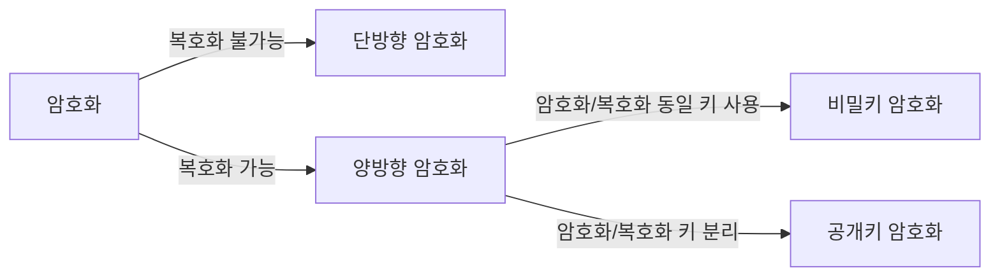
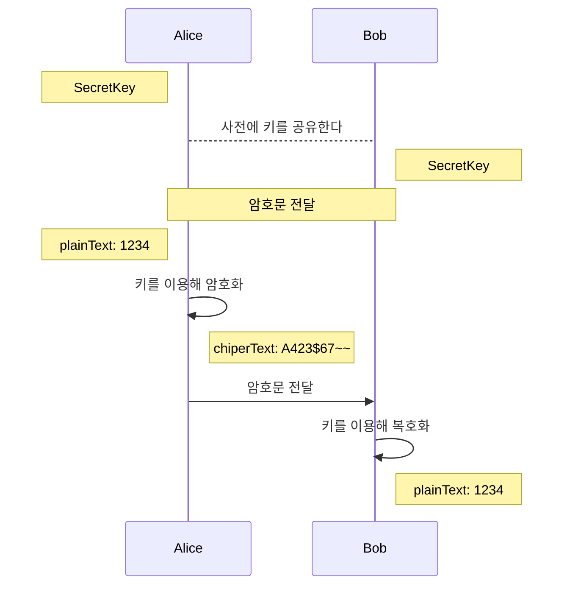
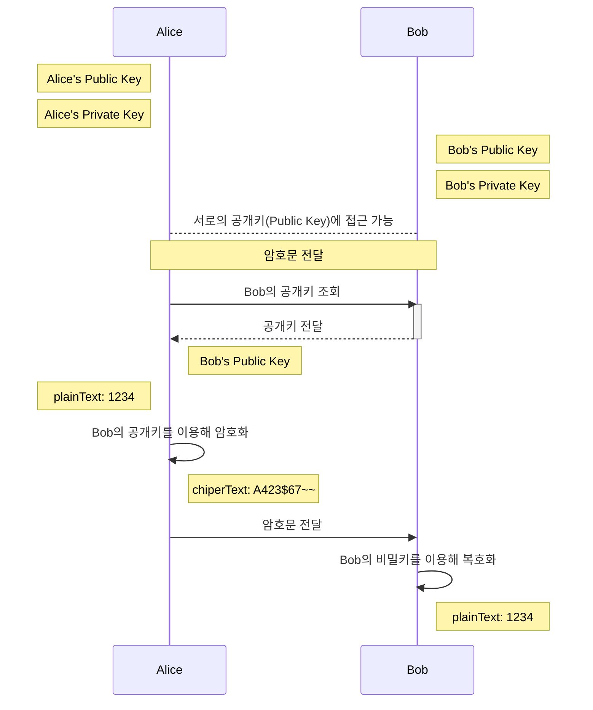

# 암호화

## 용어 설명
암호학을 이용하여 보호해야 할 메시지를 평문(plaintext)이라고 하며, 평문을 암호학적 방법으로 변환한 것을 암호문(cipherText)이라고 한다.

이때 평문을 암호문으로 변환하는 과정을 암호화(encryption)라고 하며, 암호문을 다시 평문으로 변환하는 과정을 복호화(decryption)라고 한다.

<br>

## 암호화 종류
암호화 방식은 복호화 가능 여부에 따라 단방향/양방향 암호화로 나누고, 양방향 암호화 내에서 암호화/복호화를 위해 사용되는 키에 따라 비밀키(대칭키) 암호화와 공개키(비대칭키) 암호화로 분류할 수 있다.



<br>

## 단방향 암호화
> 암호화된 데이터를 복호화할 수 없는 암호화 방식

단방향 암호화는 대표적으로 신원 증명과 인증 과정에서 사용된다. 

예를 들어 비밀번호를 ‘wiki123’이라고 지정했을 때, 이를 암호화하여 ‘A3pnqq49.Hw’라는 아무런 유사성 없는 암호문을 만들어 낸다.

단방향 암호화의 특징은 역으로 변환하는 것이 불가능하고, 어떤 방법을 쓰더라도 암호문을 원래의 평문으로 되돌릴 수 없다.

<br>

#### 단방향 암호화의 종류
- [MD5(Message-Digest algorithm 5)](https://ko.wikipedia.org/wiki/MD5)
- [SHA-2](https://ko.wikipedia.org/wiki/SHA-2)(SHA-256)

<br>

## 양방향 암호화
> 암호화된 데이터를 복호화할 수 있는 암호화 방식

<br>

### 대칭키 암호화
> 암호화와 복호화에 같은 암호키(대칭키)를 사용한다.

암호문을 생성(암호화)할 때 사용하는 키와 암호문으로부터 평문을 복원(복호화)할 때 사용하는 키가 동일한 암호 시스템이다.

암호 시스템의 안전성은 키의 길이, 키의 안전한 관리에 상대적으로 의존성이 높다.

대칭키 암호 시스템은 알고리즘이 상대적으로 단순한 장점이 있지만, 사용자 간 키를 공유해야 하고, 이를 각각 관리해야 하기에 키 관리에 어려움이 많다.

<br>

#### 암호화 및 복호화 과정


#### 대칭키 암호 시스템의 종류
대칭키 암호 시스템의 안전성은 키의 길이와 매우 관련이 크다. 일반적으로 키의 길이가 길수록 안전성은 높다. 그러나 키의 길이를 무한정 길게 하면 그에 따르는 관리의 어려움이 커진다.

- [DES](https://ko.wikipedia.org/wiki/%EB%8D%B0%EC%9D%B4%ED%84%B0_%EC%95%94%ED%98%B8%ED%99%94_%ED%91%9C%EC%A4%80)
- [AES(Advanced Encryption Standard)](https://ko.wikipedia.org/wiki/%EA%B3%A0%EA%B8%89_%EC%95%94%ED%98%B8%ED%99%94_%ED%91%9C%EC%A4%80)
- ARIA
- Twofish
- [SEED](https://ko.wikipedia.org/wiki/SEED)

<br>

### 공개키(비대칭키) 암호화
대칭키 암호 시스템의 가장 큰 약점은 키관리의 어려움에 있다. 한 사용자가 관리해야 할 키의 수가 너무 많아지기 때문이다. 

이러한 약점을 보완하기 위해 나타난 암호 시스템이 공개키 암호 시스템이다. 공개키 암호 시스템에서 각 사용자는 두 개의 키를 부여 받는다. 

그 하나는 공개되고(공개키, public key), 다른 하나는 사용자에 의해 비밀리에 관리 되어야 한다.(비밀키, private key) 공개키 암호 시스템에서 각 사용자는 자신의 비밀키만 관리하면 되므로 키 관리의 어려움을 줄일 수 있다.

<br>

#### 암호화 및 복호화 과정


<br>

#### 공개키 암호 시스템의 종류
- [RSA](https://ko.wikipedia.org/wiki/RSA_%EC%95%94%ED%98%B8)
- ElGamal
- [타원 곡선 암호](https://ko.wikipedia.org/wiki/%ED%83%80%EC%9B%90%EA%B3%A1%EC%84%A0_%EC%95%94%ED%98%B8)
- 배낭 암호

## 요약
| 암호화 방식  | 복호화 여부  | 암호회/복호화 키 | 특징  |   장점    | 단점  |         종류         |
|:-------:|:-------:|:---------:|:----:|:-------:|:----:|:------------------:|
| 단방향 암호화  | 불가능  |     -     | -  |    -    | -  |     MD5, SHA-2     |
| 대칭키 암호화  | 가능  |    동일     | 키 관리 어려움  |   빠름    | 키 관리 어려움  |   DES, AES, ...    |
| 공개키 암호화  | 가능  |    분리     | 키 관리 용이  | 키 관리 용이 | 느림  | RSA, 타원 곡선 암호, ... |

<br>

#### SSL/HTTPS?
대칭키와 공개키 암호화 방식을 적절히 혼합해서 사용하면 SSL 탄생의 시초가 된다

1. A가 **B의 공개키**로 암호화 통신에 사용할 대칭키를 암호화하고 B에게 보냄
2. B는 암호문을 받고, **자신의 비밀키**로 복호화함
3. B는 복호화 성공 여부에 따라 handshake 과정을 진행
4. 성공 시 서로에게 공유된 대칭키를 이용하여 통신

handshake 과정에서 공개키 방식을 사용하고, 이후 데이터 전송은 대칭키 방식을 사용

## 구현
> 단방향 암호화 방법의 한 종류인 SHA-256과 양방향 암호화 방법의 한 종류인 AES를 각각 구현

### SHA-256
```kotlin
object Sha256Utils {
    private const val algorithm = "SHA-256"
    private const val digits = "0123456789ABCDEF"

    fun encrypt(plainText: String): String {
        val hash: ByteArray
        try {
            val md = MessageDigest.getInstance(algorithm)
            md.update(plainText.toByteArray())
            hash = md.digest()
        } catch (e: CloneNotSupportedException) {
            throw DigestException("couldn't make digest of partial content");
        }

        return bytesToHex(hash)
    }

    private fun bytesToHex(byteArray: ByteArray): String {
        val hexChars = CharArray(byteArray.size * 2)
        for (i in byteArray.indices) {
            val v = byteArray[i].toInt() and 0xff
            hexChars[i * 2] = digits[v shr 4]
            hexChars[i * 2 + 1] = digits[v and 0xf]
        }
        return String(hexChars)
    }
}
```
```kotlin
class Sha256UtilsTest {
    @Test
    fun `SHA-256 알고리즘을 이용하여 암호화한다`() {
        // given
        val plainText = "12345678"

        // when
        val encryptedText = Sha256Utils.encrypt(plainText)

        // then
        assert(plainText != encryptedText)
        assert(encryptedText == Sha256Utils.encrypt(plainText))
    }
}
```

### AES-256 (GCM)
AES 알고리즘은 키의 길이에 따라 AES-128, AES-192, AES-256으로 나뉜다.
- AES-128 : 16bytes
- AES-192 : 24bytes
- AES-256 : 32bytes

또한 AES 알고리즘은 BCM(Block Cipher Mode)에 따라 암호화 방식이 다르다.
- ECB (Electronic Code Block)
  - 가장 기본적인 암호화 방식
  - 평문을 블록 단위로 나누어 암호화
  - 항상 같은 결과가 나오기 때문에 역추적 가능
- CBC (Cipher Block Chaining)
  - ECB의 단점을 보완한 방식으로 암호화 키에 IV(Initial Vector)를 추가해서 항상 같은 결과가 나오는 문제를 해결
  - 이전 블록의 암호문을 다음 블록의 평문과 XOR 연산을 수행
  - 병렬 처리 불가능
- GCM (Galois/Counter Mode)
  - CBC의 단점을 보완한 방식으로 병렬 처리가 가능
  - 암호문에 hash 값을 추가하여 무결성을 보장

예제는 GCM(Galois/Counter Mode) 방식으로 구현

```kotlin
object Aes256Utils {
    enum class Algorithm(val transformation: String) {
        GCM("AES/GCM/NoPadding"),
    }

    private const val KEY_SPEC_ALGORITHM = "AES"
    private const val IV_HASH_ALGORITHM = "SHA-1"
    private const val IV_LENGTH_BYTE = 12
    private const val KEY_LENGTH_BIT = 256
    private const val GCM_SPEC_TAG_LEN = 128

    private fun secretKeySpec(key: String): SecretKeySpec {
        /**
         * AES-256 알고리즘을 사용하기 위해 key를 32바이트로 설정한다
         */
        require(
            key.isNotEmpty() && key.length == KEY_LENGTH_BIT / 8
        ) { "Key must be ${KEY_LENGTH_BIT / 8} characters long, but was ${key.length} characters long." }
        val keyBytes = key.toByteArray()
        return SecretKeySpec(keyBytes, 0, KEY_LENGTH_BIT / 8, KEY_SPEC_ALGORITHM)

    }

    private fun iv(plainText: String): ByteArray {
        val ivHash = MessageDigest.getInstance(IV_HASH_ALGORITHM).digest(plainText.toByteArray())
        return Arrays.copyOf(ivHash, IV_LENGTH_BYTE)
    }

    fun encrypt(plainText: String, key: String, algorithm: Algorithm = Algorithm.GCM): String {
        /**
         * 대칭키를 생성한다
         */
        val secretKey = secretKeySpec(key)

        /**
         * 블록 암호화에서 사용되는 IV(Initialization Vector)를 생성한다
         */
        val iv = iv(plainText)

        /**
         * 암호화를 위한 파라미터를 생성한다
         * @param: tLen: 암/복호화에 사용될 인증 태그 길이 (128, 120, 112, 104, 96)
         * @param: iv: 초기화 벡터
         */
        val parameterSpec = GCMParameterSpec(GCM_SPEC_TAG_LEN, iv)

        /**
         * 암호화를 위한 Cipher 객체를 생성한다
         */
        val cipher = Cipher.getInstance(algorithm.transformation)
        cipher.init(Cipher.ENCRYPT_MODE, secretKey, parameterSpec)

        val cipherText = cipher.doFinal(plainText.toByteArray())

        return Base64.getEncoder().encodeToString(iv) +
                Base64.getEncoder().encodeToString(cipherText)
    }

    fun decrypt(input: String, password: String, algorithm: Algorithm = Algorithm.GCM): String {
        /**
         * 대칭키를 생성한다
         */
        val secretKey = secretKeySpec(password)

        /**
         * 암호화된 문자열을 디코딩한다
         */
        val ivAndCipherText = Base64.getDecoder().decode(input)

        /**
         * IV와 암호화된 문자열을 분리한다
         */
        val iv = ivAndCipherText.sliceArray(0 until IV_LENGTH_BYTE)
        val cipherText = ivAndCipherText.sliceArray(IV_LENGTH_BYTE until ivAndCipherText.size)

        /**
         * 복호화를 위한 파라미터를 생성한다
         * @param: tLen: 암/복호화에 사용될 인증 태그 길이 (128, 120, 112, 104, 96)
         * @param: iv: 초기화 벡터
         */
        val parameterSpec = GCMParameterSpec(GCM_SPEC_TAG_LEN, iv)

        /**
         * 복호화를 위한 Cipher 객체를 생성한다
         */
        val cipher = Cipher.getInstance(algorithm.transformation)
        cipher.init(Cipher.DECRYPT_MODE, secretKey, parameterSpec)

        val plainText = cipher.doFinal(cipherText)

        return String(plainText)
    }
}
```
```kotlin
class Aes256UtilsTest {
    @Test
    fun `AES-256 GCM 알고리즘을 사용하여 암호화 및 복호화를 진행한다`() {
        // given
        val key = "12345678901234567890123456789012"
        val plainText = "12345678"

        // when
        val encryptedText = Aes256Utils.encrypt(plainText, key)
        val decryptedText = Aes256Utils.decrypt(encryptedText, key)

        // then
        assert(plainText != encryptedText)
        assert(plainText == decryptedText)
    }
}
```