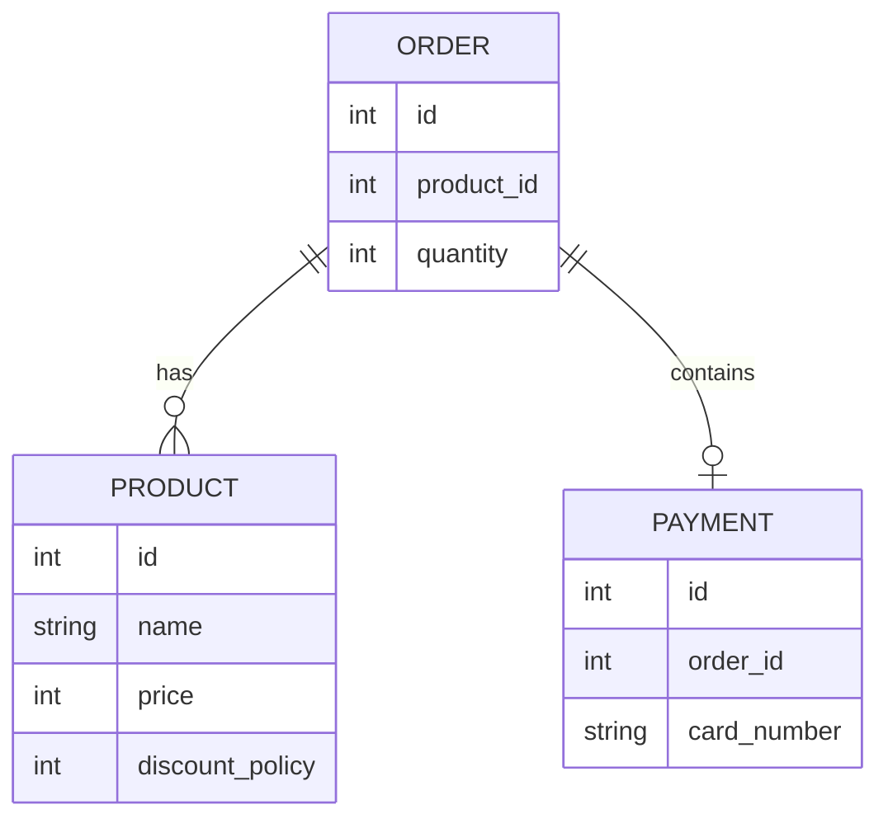

```mermaid
erDiagram
    PRODUCT {
        int id
        string name
        int price
        int discount_policy
    }
    ORDER {
        int id
        int product_id
        int quantity
    }
    PAYMENT {
        int id
        int order_id
        string card_number
    }
    ORDER ||--o{ PRODUCT : has
    ORDER ||--o| PAYMENT : contains
```